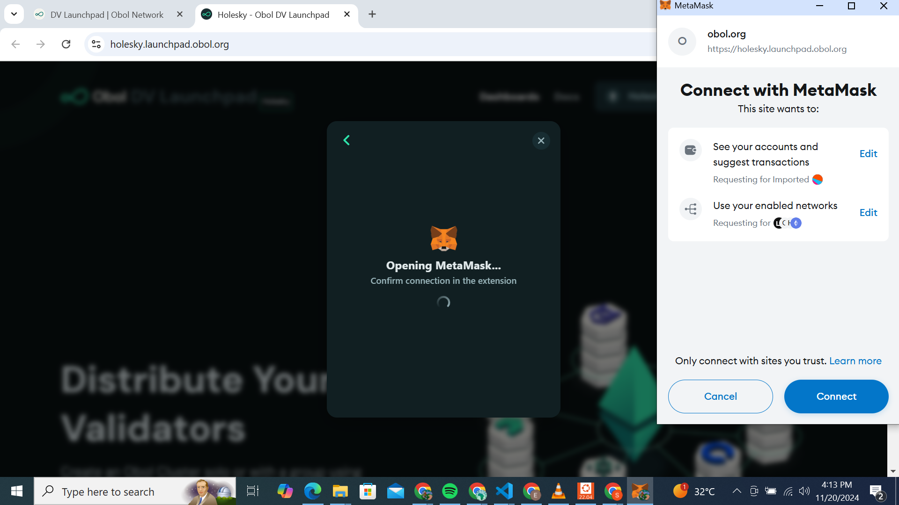

# Obol University Squad Stakin

perequisite

`sudo wget -O - https://prerequisites.dappnode.io | sudo bash`


1. Get your ENR

```

root@DESKTOP-VM8UCIK:~# ssh -i charon_key.pem ubuntu@54.211.205.4
Welcome to Ubuntu 22.04.5 LTS (GNU/Linux 6.8.0-1015-aws x86_64)

 * Documentation:  https://help.ubuntu.com
 * Management:     https://landscape.canonical.com
 * Support:        https://ubuntu.com/pro

 System information as of Thu Nov 21 00:05:00 UTC 2024

  System load:  0.21              Processes:             111
  Usage of /:   6.2% of 48.27GB   Users logged in:       0
  Memory usage: 11%               IPv4 address for ens5: 172.31.47.2
  Swap usage:   0%

 * Ubuntu Pro delivers the most comprehensive open source security and
   compliance features.

   https://ubuntu.com/aws/pro

Expanded Security Maintenance for Applications is not enabled.

21 updates can be applied immediately.
11 of these updates are standard security updates.
To see these additional updates run: apt list --upgradable

Enable ESM Apps to receive additional future security updates.
See https://ubuntu.com/esm or run: sudo pro status

New release '24.04.1 LTS' available.
Run 'do-release-upgrade' to upgrade to it.


*** System restart required ***
Last login: Thu Nov 21 00:02:30 2024 from 102.88.43.147
ubuntu@ip-172-31-47-2:~$ git clone https://github.com/ObolNetwork/charon-distributed-validator-node.git
Cloning into 'charon-distributed-validator-node'...
remote: Enumerating objects: 1328, done.
remote: Counting objects: 100% (473/473), done.
remote: Compressing objects: 100% (194/194), done.
remote: Total 1328 (delta 390), reused 316 (delta 265), pack-reused 855 (from 1)
Receiving objects: 100% (1328/1328), 603.45 KiB | 12.07 MiB/s, done.
Resolving deltas: 100% (787/787), done.
ubuntu@ip-172-31-47-2:~$ cd charon-distributed-validator-node/
ubuntu@ip-172-31-47-2:~/charon-distributed-validator-node$ docker run --rm -v "$(pwd):/opt/charon" obolnetwork/charon:v1.1.2 create enr
Unable to find image 'obolnetwork/charon:v1.1.2' locally
v1.1.2: Pulling from obolnetwork/charon
a480a496ba95: Pull complete
f3279abc0f2c: Pull complete
e73a37a54ee8: Pull complete
bcf66212e70b: Pull complete
bd3f5792687a: Pull complete
66bff200563e: Pull complete
4f4fb700ef54: Pull complete
ec985b2fb697: Pull complete
6231a08b2179: Pull complete
Digest: sha256:5a32a6ebee8fa67530d922b3031c554020844fb435495f204299df0f4049bead
Status: Downloaded newer image for obolnetwork/charon:v1.1.2
Created ENR private key: .charon/charon-enr-private-key
enr:-HW4QFZ_TKqeBECTfrHwJjOclPmTmuRz2xs3ZU9_D8CjBVqjAzbFwz561E23CUTiksKza0nf53psrjx9g8hb6ix2KMGAgmlkgnY0iXNlY3AyNTZrMaECOCKwF056QnDA-gqPrlKq6OSKcOF4UAx7J5JHcgjPpj4

***************** WARNING: Backup key **********************
 PLEASE BACKUP YOUR KEY IMMEDIATELY! IF YOU LOSE YOUR KEY,
 YOU WON'T BE ABLE TO PARTICIPATE IN RUNNING A CHARON CLUSTER.

 YOU CAN FIND YOUR KEY IN .charon/charon-enr-private-key
****************************************************************

ubuntu@ip-172-31-47-2:~/charon-distributed-validator-node$ exit
logout
Connection to 54.211.205.4 closed.
root@DESKTOP-VM8UCIK:~# c


```

2. Create a cluster or accept an invitation to a cluster

visit [https://holesky.launchpad.obol.org/](https://holesky.launchpad.obol.org/)

connect wallet


<figure><figcaption></figcaption></figure>

<figure><figcaption></figcaption></figure>

<figure><figcaption></figcaption></figure>

<figure><figcaption></figcaption></figure>

<figure><figcaption></figcaption></figure>

<figure><figcaption></figcaption></figure>

<figure><figcaption></figcaption></figure>

<figure><figcaption></figcaption></figure>

<figure><figcaption></figcaption></figure>

<figure><figcaption></figcaption></figure>

<figure><figcaption></figcaption></figure>

<figure><figcaption></figcaption></figure>

<figure><figcaption></figcaption></figure>

<figure><figcaption></figcaption></figure>

<figure><figcaption></figcaption></figure>

```
0x6245d8939a7a1491a0b8c04a7354f62dea17ac2e
```

[view on etherscan](https://holesky.etherscan.io/address/0x6245d8939a7a1491a0b8c04a7354f62dea17ac2e#code)

<figure><figcaption></figcaption></figure>

<figure><figcaption></figcaption></figure>

<figure><figcaption></figcaption></figure>

<figure><figcaption></figcaption></figure>

lauchpad: https://holesky.launchpad.obol.org/dv#0x28bbebb8087ab4d754d9003c8ff5562ddc1fa8d694ac00771b36ae3e3f526394&#x20;

status : [https://holesky.launchpad.obol.org/dv/accept-configuration/](https://holesky.launchpad.obol.org/dv/accept-configuration/)

Link: [https://holesky.launchpad.obol.org/invite-group/?configHash=0x28bbebb8087ab4d754d9003c8ff5562ddc1fa8d694ac00771b36ae3e3f526394](https://holesky.launchpad.obol.org/invite-group/?configHash=0x28bbebb8087ab4d754d9003c8ff5562ddc1fa8d694ac00771b36ae3e3f526394)&#x20;

```
https://holesky.launchpad.obol.org/dv#0x28bbebb8087ab4d754d9003c8ff5562ddc1fa8d694ac00771b36ae3e3f526394

https://holesky.launchpad.obol.org/dv/accept-configuration/
```

