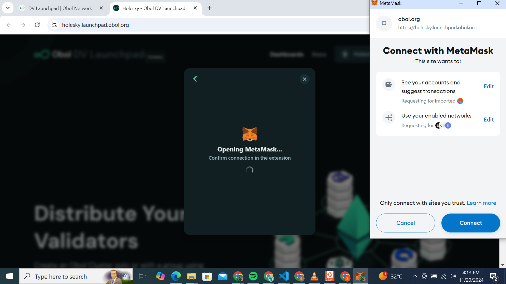

# Copy of How to Set Up an Ethereum Validator Node In Africa

#### **Hardware Requirements for Running an Ethereum Node**. 

To run an Ethereum node, you’ll need a computer with sufficient processing power and storage capacity. You can use Windows, Mac, or Linux operating systems. For a full Ethereum node, the minimum requirements are:

* **16 GB of RAM**
* **Dual-core CPU** (e.g., Intel Core i5-760 or AMD FX-8100 or better)
* **At least 1 TB SSD** of free disk space
* **At least 32 ETH** for staking
* **Stable broadband internet connection** with speeds of at least 5 Mbps upload and download, plus a minimum of 2 TB of monthly data.

For better performance, it's recommended to have:

* **32 GB of RAM**
* **Quad-core CPU** (e.g., Intel Core i7-4770 or AMD FX-8310 or better)
* **4 TB NVMe SSD**
* **64-bit Linux** (such as Ubuntu 22.04.1 LTS)
* **Stable broadband internet connection** with speeds of at least 10 Mbps and ideally no data cap, along with at least 2 TB of monthly data.

Additionally, you'll need some ETH for transaction fees. The faster your hardware, the quicker your node will sync with the blockchain.

Keep in mind that running an Ethereum node requires significant resources, which may lead to increased energy consumption and potential overheating. Ensure you have adequate cooling solutions in place.

#### **Choosing Your Network Configuration** 

When setting up your Ethereum node, you’ll need to choose a network configuration that determines how your node connects to the broader Ethereum network. The two main options are Mainnet and Testnet.\
\
Mainnet is the primary Ethereum blockchain used for real-world transactions, while Testnet is a testing environment for developers to experiment with smart contracts and applications without spending real Ether. Whichever option you choose will impact the resources required to run an ETH node as well as its functionality. So make sure you understand the differences between them before making a decision.

#### **Installing Ethereum Execution Client** 

After the PoS Ethereum hard fork, the Service contains a few layers: execution and consensus, and to validate, validator layers.

Installing the Ethereum execution layer software (client) is the next step after ensuring that your hardware meets the requirements. There are several execution clients to choose from, including Geth, Nethermind,  Besu, or Erigon. Each client has its own features and installation processes. Visit [this page](ethereum-staking-guide/ethereum-staking-guide/setting-up-a-validator-on--holesky-testnet/step-4-installing-consensus-client/) to choose and install a consensus client.

Once you have chosen an execution client, download it from their official website or GitHub repository and follow the [installation instructions](ethereum-staking-guide/ethereum-staking-guide/setting-up-a-validator-on--holesky-testnet/step-4-installing-consensus-client/).

It’s vital to ensure that you download the latest version of the client for optimal performance and security.

After successful installation, configure your network settings in preparation for syncing and test if your execution client is running correctly by running the client start/run command on your terminal/command prompt. If everything runs smoothly, proceed to installing your consensus client.

#### **Install Consensus Client** 

The consensus layer of Ethereum keeps the network secure, especially after its switch to proof-of-stake (PoS). It decides which transaction blocks are valid, tracks validators who secure the network, and processes their votes to ensure agreement. It rewards good behavior and punishes bad actions. Key clients like Prysm and Lighthouse help manage these tasks, ensuring Ethereum runs smoothly and securely.

Follow[ this guide](ethereum-staking-guide/ethereum-staking-guide/setting-up-a-validator-on--holesky-testnet/step-4-installing-consensus-client/) to select, install, configure, and run a consensus client.

After successful installation, test if your node is running correctly by entering the run/start command on your terminal/command prompt. If everything runs smoothly, proceed to configure your network settings in preparation for syncing with the Ethereum blockchain.

Start both clients. The execution client will begin downloading the blockchain data, while the consensus client will connect to the network and begin its validation tasks.

Then you need to Set up network connectivity: Your Ethereum node needs to be reachable by other nodes on the network. Ensure your network configuration allows inbound connections to the Ethereum network’s default ports (TCP/UDP 30303). If you’re behind a router or firewall, you may need to set up port forwarding or open the necessary ports. Check out [this guide](ethereum-staking-guide/ethereum-staking-guide/setting-up-a-validator-on--holesky-testnet/step-2-configuring-node.md) for more info. The HTTP connection between your beacon node and execution node needs to be authenticated using a JWT token. There are several ways to generate this JWT token. Also check out the [JWT section in this guide](ethereum-staking-guide/ethereum-staking-guide/setting-up-a-validator-on--holesky-testnet/step-2-configuring-node.md).

<figure><figcaption>
Simplified diagram of a coupled execution and consensus client.  Source: <a href="https://ethereum.org/en/developers/docs/nodes-and-clients/">https://ethereum.org/en/developers/docs/nodes-and-clients/</a>
</figcaption></figure>

#### **Install Validator Client** 

A validator is a virtual entity on the Beacon Chain that represents a balance, public key, and other attributes, participating in Ethereum's consensus. The validator client is the software that operates on behalf of the validator, using its private key to make attestations about the blockchain's state. One validator client can manage multiple key pairs and control several validators. It can manage multiple validators. The client verifies new blocks, re-executes transactions, and broadcasts votes (attestations) to confirm valid blocks. It also helps maintain network security by producing blocks when selected and monitoring the network for updates.

Follow [this guide](ethereum-staking-guide/ethereum-staking-guide/setting-up-a-validator-on--holesky-testnet/step-5-installing-validator/) to configure and setup a validator.

**Secure your node**

Running an Ethereum node means you become part of the network and handle valuable assets. Take measures to secure your node, such as enabling firewall protection, configuring SSH access, and keeping your system, consensus, execution, and validator client up to date with the latest security patches.

**Monitor and maintain**

&#x20;Running an Ethereum node requires ongoing maintenance. Keep an eye on the node’s performance, disk space usage, and the latest updates and announcements from the Ethereum community. Regularly update your client to ensure compatibility with the evolving Ethereum network.

It’s worth noting that running your own Ethereum validator node can be a resource-intensive task. It comes with technical, financial, and hardware/resources challenges.

\

