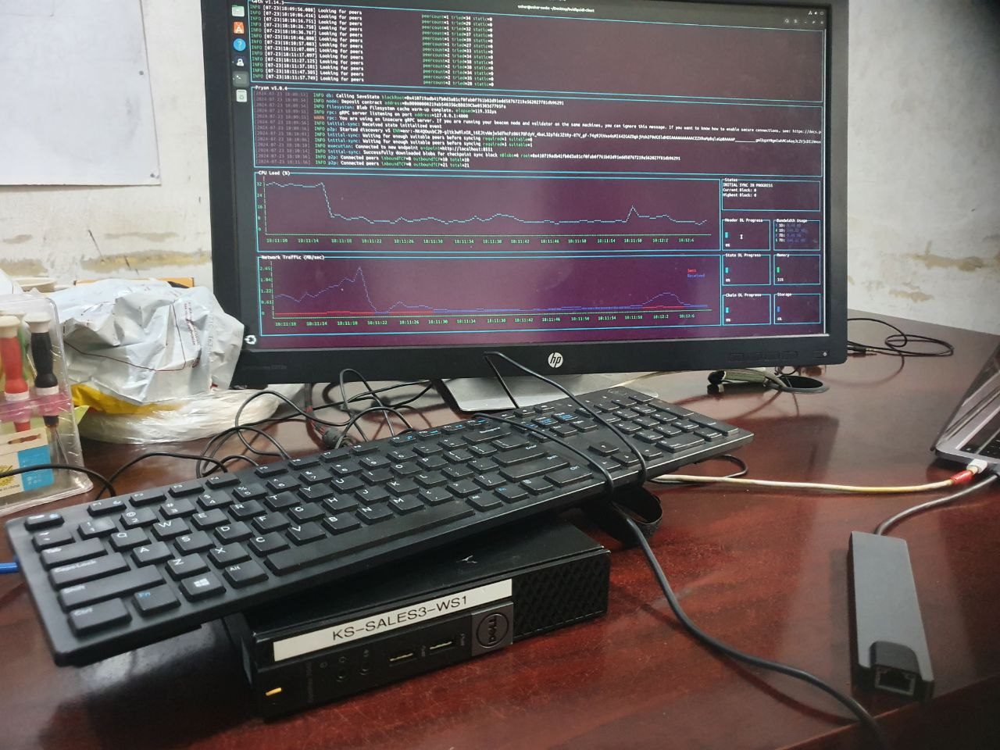
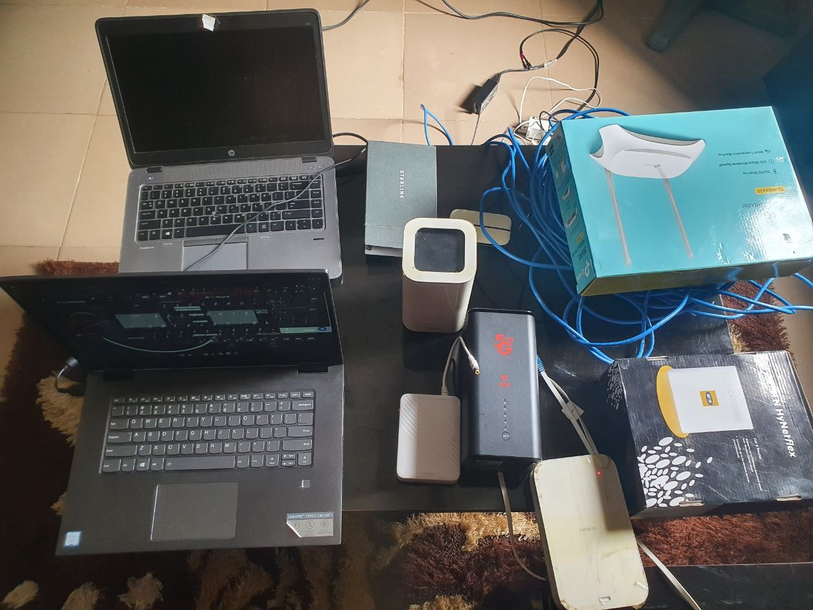

# Setting Up an Ethereum Validator Node In Africa

#### Hardware Requirements for Running an Ethereum Node

To successfully run an Ethereum node, it’s essential to have a computer that meets specific hardware requirements. You can use operating systems like Windows, Mac, or Linux. Below are the **minimum requirements** for a full Ethereum node:

**Minimum Requirements:**

* **RAM**: 16 GB
* **CPU**: Dual-core processor (e.g., Intel Core i5-760 or AMD FX-8100 or better)
* **Storage**: At least 1 TB SSD of free disk space
* **ETH for Staking**: At least 32 ETH
* **Internet Connection**: Stable broadband with speeds of at least 5 Mbps upload and download, along with a minimum of 2 TB of monthly data.

**Recommended for Better Performance:**

* **RAM**: 32 GB
* **CPU**: Quad-core processor (e.g., Intel Core i7-4770 or AMD FX-8310 or better)
* **Storage**: 4 TB NVMe SSD
* **Operating System**: 64-bit Linux (e.g., Ubuntu 22.04.1 LTS)
* **Internet Connection**: Stable broadband with speeds of at least 10 Mbps and ideally no data cap, alongside at least 2 TB of monthly data.

\[]

<figure><figcaption>
Bare Metal Set up for Running a Node
</figcaption></figure>

<figure><figcaption>
Different Internet Service Providers Utilised during experimentation
</figcaption></figure>

#### Additional Considerations:

* **Transaction Fees**: You’ll also need some ETH for transaction fees, which are necessary for staking operations on the network.

Running an Ethereum node is resource-intensive and may lead to increased energy consumption. Make sure your hardware is capable of handling the load to avoid overheating. Implementing adequate cooling solutions is essential.

#### Choosing Your Network Configuration

When setting up your Ethereum node, you will need to select a network configuration, which affects how your node interacts with the Ethereum ecosystem. The two primary options are:

* **Mainnet**: This is the primary Ethereum blockchain where real-world transactions occur. Operating on the mainnet involves actual ETH and contributes to the network's security and functionality.
* **Testnet**: This is a testing environment designed for developers to experiment with smart contracts and applications without the risk of using real ETH. It allows for testing new features and functionalities without financial implications.

#### Installing the Ethereum Execution Client

Once you have verified that your hardware meets the necessary requirements, the next step is to install an execution client. The execution client is responsible for processing transactions and maintaining the state of the blockchain. Popular execution clients include:

* **Geth**
* **Nethermind**
* **Besu**
* **Erigon**

**Installation Steps:** Kindly follow [this guide](ethereum-staking-guide/ethereum-staking-guide/setting-up-a-validator-on--holesky-testnet/step-3-installing-execution-client/) for easy setup.

1. **Download**: Choose an execution client and download it from its official website or GitHub repository. Ensure you are downloading the latest version to benefit from the latest features and security improvements.
2. **Installation**: Follow the [installation instructions](ethereum-staking-guide/ethereum-staking-guide/setting-up-a-validator-on--holesky-testnet/step-3-installing-execution-client/) specific to your operating system. This may include running commands in the terminal or executing setup files.
3. **Configuration**: After installation, configure your network settings. This includes setting parameters like network ID, data directories, and peer connections.
4. **Verification**: Test if the execution client is running correctly by using the appropriate start/run command in your terminal or command prompt. Monitor the logs to ensure there are no errors.

#### Install the Consensus Client

The consensus client is vital for maintaining the security of the Ethereum network, especially after the transition to proof-of-stake (PoS). It validates blocks, tracks validators, and processes their attestations.

**Popular Consensus Clients:** Kindly follow [this guide](ethereum-staking-guide/ethereum-staking-guide/setting-up-a-validator-on--holesky-testnet/step-4-installing-consensus-client/) for easy setup.

* **Prysm**
* **Lighthouse**
* **Teku**
* **Nimbus**

**Installation Steps:**

1. **Download**: Select a consensus client and download it from the official source.
2. **Installation**: Follow the [specific installation instructions](ethereum-staking-guide/ethereum-staking-guide/setting-up-a-validator-on--holesky-testnet/step-4-installing-consensus-client/) provided for your chosen client.
3. **Configuration**: Once installed, configure your network settings similarly to the execution client.
4. **Verification**: Use the run/start command to check if the consensus client is operating correctly. Ensure it can connect to the Ethereum network.

<figure><figcaption>
Simplified diagram of a coupled execution and consensus client.  Source: <a href="https://ethereum.org/en/developers/docs/nodes-and-clients/">https://ethereum.org/en/developers/docs/nodes-and-clients/</a>
</figcaption></figure>

#### Set Up Network Connectivity

For your Ethereum node to communicate effectively with the network, you need to ensure it is reachable by other nodes. Checkout [this configuration guide](ethereum-staking-guide/ethereum-staking-guide/setting-up-a-validator-on--holesky-testnet/step-2-configuring-node.md):

* **Inbound Connections**: Configure your network to allow inbound connections on Ethereum’s default ports (TCP/UDP 30303).
* **Router/Firewall Configuration**: If your node is behind a router or firewall, you may need to set up port forwarding or open these ports to facilitate connections.

Additionally, secure the HTTP connection between your beacon node and execution node using a JWT token. Refer to [specific guides on generating and implementing JWT tokens](ethereum-staking-guide/ethereum-staking-guide/setting-up-a-validator-on--holesky-testnet/step-2-configuring-node.md).

#### Install the Validator Client

A validator is a crucial part of the Ethereum ecosystem, participating in the network’s consensus. The validator client operates on behalf of the validator, managing its private keys and making attestations about the blockchain’s state.&#x20;

**Validator Client Responsibilities:**

* **Verification**: The client verifies new blocks and re-executes transactions to confirm their validity.
* **Attestations**: It broadcasts votes (attestations) to signal agreement with valid blocks.
* **Network Security**: The validator client contributes to network security by producing blocks when selected and monitoring for updates.

**Installation Steps:** Kingly [checkout this guide](ethereum-staking-guide/ethereum-staking-guide/setting-up-a-validator-on--holesky-testnet/step-5-installing-validator/)

1. **Download**: Choose a validator client and download it from its official source.
2. **Installation**: Follow the [installation instructions](ethereum-staking-guide/ethereum-staking-guide/setting-up-a-validator-on--holesky-testnet/step-5-installing-validator/) provided for the client.
3. **Configuration**: Properly configure the client to manage your validator keys and connect to the network.
4. **Verification**: Ensure the validator client is running correctly and can communicate with both the execution and consensus clients.

#### Secure Your Node

Running an Ethereum node means you are part of the network and handling valuable assets. It’s crucial to implement security measures:

* **Firewall Protection**: Enable a firewall to protect against unauthorized access.
* **SSH Access**: Configure SSH access securely for remote management.
* **Regular Updates**: Keep your system, execution client, consensus client, and validator client updated with the latest security patches to mitigate vulnerabilities.

#### Monitor and Maintain Your Node

Ongoing maintenance is vital for a well-functioning Ethereum node. Here are key practices:

* **Performance Monitoring**: Regularly check your node’s performance and resource usage.
* **Disk Space Management**: Keep an eye on disk space to ensure you don’t run out, which could affect performance.
* **Stay Informed**: Follow updates and announcements from the Ethereum community to stay aligned with network changes.
* **Regular Updates**: Frequently update your clients to ensure compatibility with the evolving Ethereum network.

### Challenges Faced

Setting up an Ethereum validator node in Africa was a journey filled with challenges, but it also sparked a sense of community and resilience among us at NodeBridge Africa.

**Energy Challenge**

One of the first hurdles was our unreliable power supply. Frequent outages threatened our node's uptime. After much deliberation, we invested in a solar inverter system with lithium batteries and a backup generator. Watching those solar panels go up felt empowering, knowing we were harnessing renewable energy for our tech ambitions.

\[]

<figure><figcaption>
Alternative sources of power
</figcaption></figure>

**Knowledge Gap**

As we navigated the technical landscape, we realized many in our community needed more education about running a node. To tackle this, we organized workshops, inviting experts to demystify the process. These sessions were enlightening; seeing people grasp complex concepts and gain confidence was incredibly rewarding.

\[]

<figure><figcaption>
Running an Ethereum Node Workshop at Blockspace, Lagos, Nigeria
</figcaption></figure>



**Internet Connectivity Challenges**

Next came the struggle for stable internet. We opted for Starlink and fiber optics, but quickly hit a wall with port forwarding issues. Instead of getting discouraged, we banded together and found a solution using a VPN for a static IP address. The moment we got it working was a huge relief and a testament to our teamwork.

\[]

**Configuration and technical challenges**

Configuring the node presented its own set of challenges. We faced numerous errors, but each mistake taught us something new. We created a shared document to track our process, which streamlined our efforts and strengthened our bonds as a team.

\[]

After weeks of hard work, our validator node finally went live. The sense of accomplishment was surreal. We had overcome significant obstacles and fostered a spirit of collaboration in our community. This journey reminded us that while challenges can be daunting, they also pave the way for growth and innovation. We’re just getting started, and we can’t wait to see how we continue to contribute to the Ethereum network and inspire others in our region.



